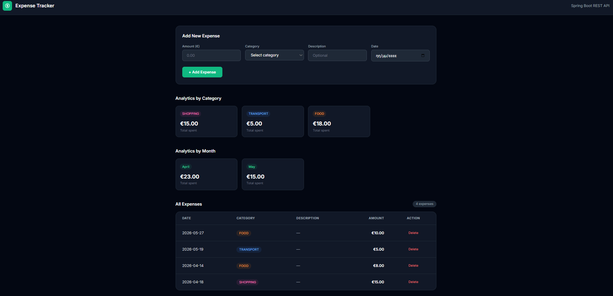

# Expense Tracker API

A REST API for personal finance management — tracking expenses
by category with monthly analytics and reporting.

## Tech Stack
- Java 17, Spring Boot 3.5
- PostgreSQL 17
- Docker & Docker Compose
- HTML, Tailwind CSS, Vanilla JavaScript

## Features
- Add / edit / delete expenses
- Category management (Food, Transport, Shopping, Health, Entertainment)
- Monthly and category analytics
- Simple frontend UI served by Spring Boot
- Fully containerized with Docker

## Architecture
Request → Controller → Service → Repository → PostgreSQL

## About
Built as a learning project to practice:
- RESTful API design with Spring Boot
- JPA/Hibernate with custom JPQL queries
- Docker containerization

## Run with Docker
Make sure Docker Desktop is running, then:

```bash
docker-compose up --build
```

Open http://localhost:8080/index.html

## Run Locally (without Docker)
```bash
mvnw.cmd spring-boot:run
```
Requires PostgreSQL running on port 5433.

## API Endpoints
| Method | URL | Description |
|--------|-----|-------------|
| GET | /expenses | Get all expenses |
| GET | /expenses/{id} | Get expense by id |
| POST | /expenses | Create expense |
| PUT | /expenses/{id} | Update expense |
| DELETE | /expenses/{id} | Delete expense |
| GET | /expenses/analytics/category | Total by category |
| GET | /expenses/analytics/month | Total by month |

## Preview
